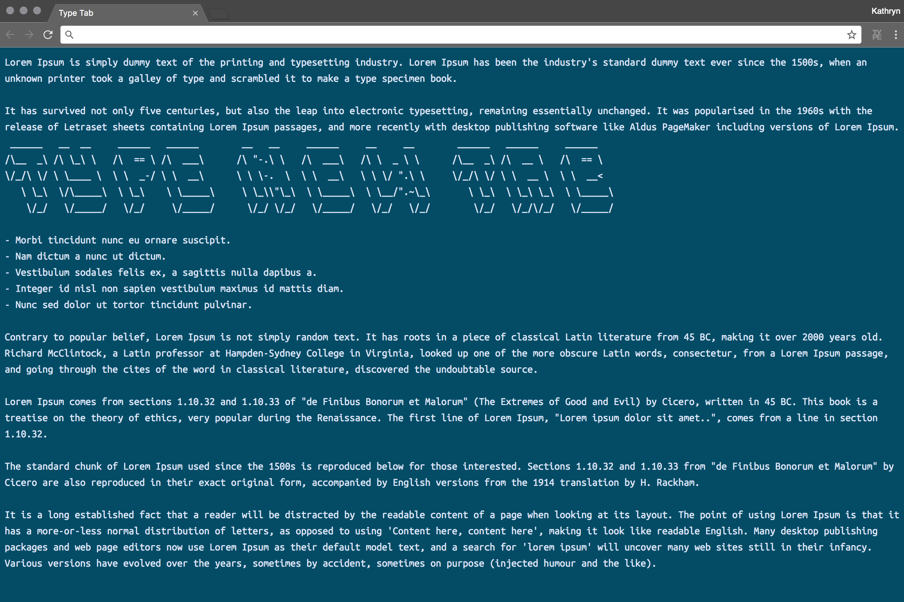
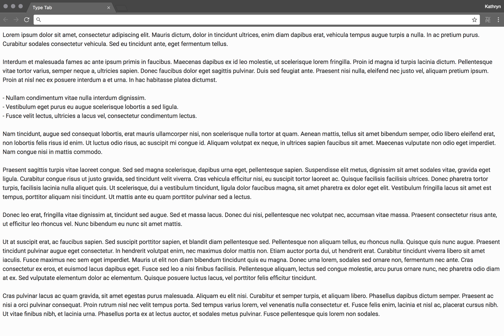
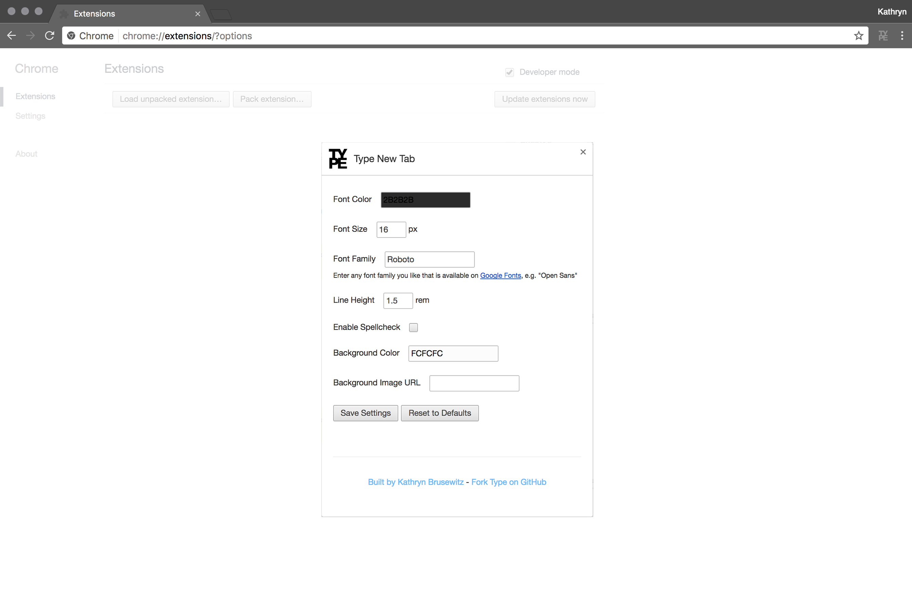

# Type New Tab
A dead simple and customizable new tab Chrome extension for typing and saving notes. Auto-saves as you type and syncs across browsers wherever you're signed into your Google account.

Options include:
- Font color
- Font size
- Font family
- Line height
- Enable spellcheck
- Background color
- Background image url

## Installing
This is just a development release. Download or clone this repo as an unpacked extension.

1. If you downloaded the code, unzip the file.
2. Open `chrome://extensions/` or select the menu `Window > Extensions`.
3. Enable developer mode at top right.
4. Click `Load unpacked extension...` and select the source code folder.

## Screenshots

## Links
- [Chrome.storage.sync example](https://gist.github.com/IzumiSy/765cfd6dc02c79de875e)
- [Chrome.storage API](https://developer.chrome.com/extensions/storage)
